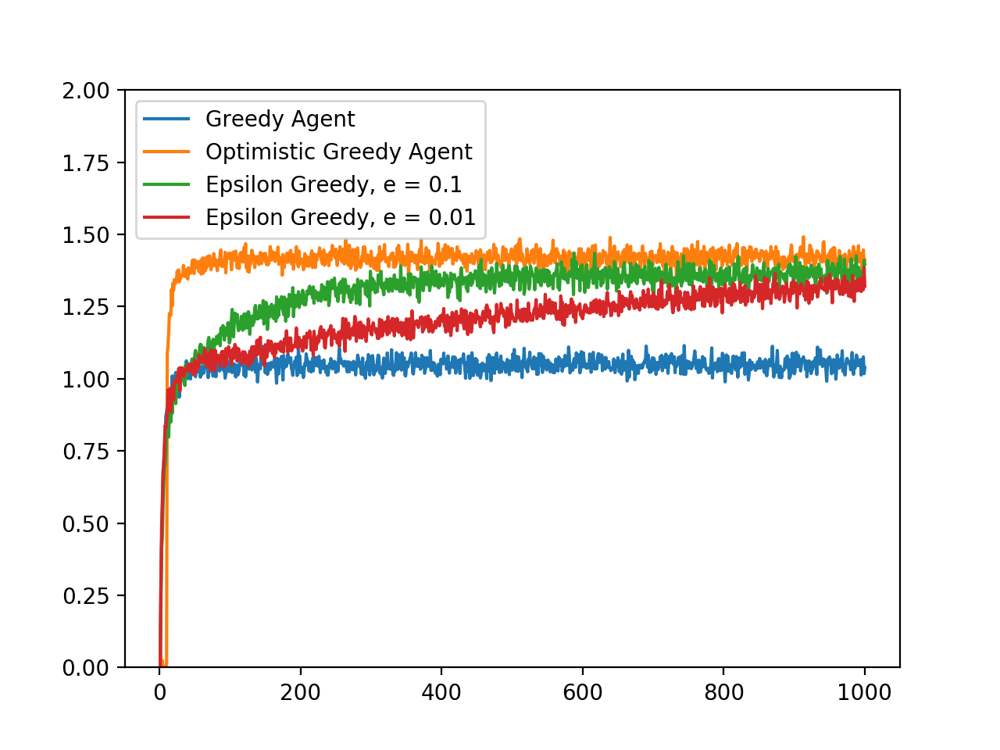

# 10-Armed Bandit Test Bed

My own implementation of a few agents and a k-armed bandit environment.

The graph above shows the mean reward for each agent at each time step. The mean was from 2000 runs.

